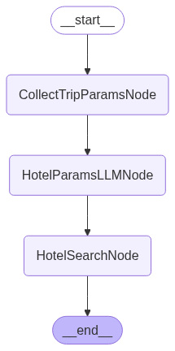

# AgentProject-1
The first agent project 

# LangGraph Travel Planner Template

Opinionated, production-minded LangGraph template for building scalable, observable, multi-tool AI agent applications (travel planning example included).

---

## 🚀 Why this template?

This repository gives you a strong, opinionated starting point to build complex LangGraph-based systems that can:

* Route user intent across multiple specialized nodes (chitchat, task-specific, escalation, external airline MCP, etc.)
* Support human-in-the-loop interruptions (e.g. collecting missing trip parameters)
* Instrument every run with Langfuse for observability & evaluation
* Extend cleanly via a `NodeFactory` and typed `State` models
* Ship a UI (Reflex) already wired to your graph

While the included example focuses on a travel-planning assistant (with a Turkish Airlines MCP integration), the structure is designed so you can swap in your own domain quickly.

---

## ✅ Requirements

Core stack:

* Python 3.13+
* Node.js (for MCP remote & Reflex frontend – tested with >= 18 LTS)
* An OpenAI API key (or adjust LLM provider in settings)
* A Langfuse account (cloud or self-hosted) for tracing/observability (It's free to open an account)
* (Optional) [Miles&Smiles account](https://www.turkishairlines.com/en-tr/miles-and-smiles/sign-up-form/) for Turkish Airlines MCP interaction

System tools you should have available in $PATH (or configure explicitly):

* `mcp-remote` (or accessible via `npx mcp-remote`)
* `reflex` (installed via Python dependency) – run the UI

---

## 📁 Project Layout (Key Concepts)

```text
src/travel_planner/
	graphs/               # Graph wiring & topology (StateGraph construction)
	nodes/                # Node implementations (async run methods)
	models/               # Pydantic state + routing models
	prompts/              # Prompt YAML / templates handling
	settings/             # Typed settings loaders (e.g. OpenAI config)
	helpers/              # LLM utils, logging, small abstractions
	ui/                   # Reflex app (already connected to compiled graph)
	main.py               # Factory function to compile the graph
```

Key architectural elements:

* `TravelPlannerState` – Central shared state passed between nodes.
* `NodeFactory` – Centralized construction; makes adding/removing nodes atomic.
* `TravelPlannerGraph` – Declares nodes + edges (routing + conditional logic + finish points).
* Human-in-the-loop – Implemented via `interrupt_before=[trip_params_human_input_node]` during compilation.

---

## 🧭 Graph Overview

The high-level routing & execution flow:

1. User input enters the Router Node.
2. Router decides among: Chitchat | Travel Planner Flow | Turkish Airlines | Escalation.
3. Travel planning branch extracts → (optionally fixes) → collects missing info (human) → plans trip.
4. Certain branches (chitchat, escalation, Turkish Airlines, final plan) are finish points.

Visual (see `docs/langgraph.png`):



---

## 🔐 Environment Setup

Copy the example environment file and fill in values:

```bash
cp .env.example .env
```

Required variables (see `.env.example` for comments):

* `OPENAI_API_KEY`
* `LANGFUSE_SECRET_KEY`, `LANGFUSE_PUBLIC_KEY`, `LANGFUSE_HOST`
* `NODE_BIN_PATH` – Directory containing Node.js binaries (used when spawning MCP processes)
* `MCP_REMOTE_COMMAND` – Usually `mcp-remote` or `npx mcp-remote`

### Langfuse Account

Create an account at: <https://cloud.langfuse.com> (or point `LANGFUSE_HOST` to your self-host). Populate keys in `.env`. Traces will automatically appear when you interact with the app.

### Turkish Airlines MCP

To enable the Turkish Airlines integration:

1. Ensure `NODE_BIN_PATH` points to your Node bin directory (e.g. `/usr/local/bin` or `~/.nvm/versions/node/vXX/bin`).
2. Ensure `mcp-remote` is installed globally or runnable via `npx`.
3. Create / log in to a Miles&Smiles account (normal Turkish Airlines loyalty account).
4. When you ask a THY-related question, the login screen will auto-open in your browser for authentication.

---

## 🛠 Installation

Using `uv` (recommended, super fast) or `pip`.

### With uv

```bash
uv sync
```

### With pip (fallback)

```bash
python -m venv .venv
source .venv/bin/activate
pip install -e .[dev]
```

---

## ▶️ Running the App (Reflex UI)

The Reflex frontend is already wired to the compiled LangGraph.

```bash
reflex run
```

This will:

* Load `.env`
* Spin up the API/backend + frontend
* Allow chat-style interaction with routing + MCP + Langfuse tracing

Open the printed local URL in your browser and start asking travel or airline questions.

---

## 🧩 Extending The Template

Add a new capability (example outline):

1. Create new node class under `nodes/` with an `async_run(state) -> dict` method.
2. Register it in `NodeFactory` (ensure it exposes `node_id` + logic).
3. Wire it in `TravelPlannerGraph._add_nodes` and `_connect_edges` (add conditional or static edges).
4. Update routing model (e.g. add enum value to `Routes`) if it's a router destination.
5. Add prompts / settings as needed.
6. (Optional) Add human-in-the-loop interruption by including its node id in `interrupt_before` during compilation.

Because the template isolates concerns, changes stay localized.

---

## 🔍 Observability (Langfuse)

Instrumentation hooks are automatically picked up if Langfuse keys are present. Use the Langfuse UI to:

* Inspect token usage
* Evaluate prompt/output quality
* Trace multi-node executions

For additional custom events, you can import and emit Langfuse spans in node logic.

---

## 🛡️ Production Hardening Suggestions

* Add structured retry + timeout wrappers around external calls.
* Persist checkpointing (replace `MemorySaver()` with a database-backed saver for resilience).
* Add guardrails / content filters before final responses.
* Implement evaluation workflows with Langfuse scores.
* Containerize (multi-stage Dockerfile) and add CI lint + type + test gates.

---

## 🗺️ Adapting to a Different Domain

To repurpose this template (e.g. e-commerce agent, support triage, research assistant):

* Swap `TravelPlannerState` fields for domain-specific ones.
* Replace or augment nodes (retrieval, tool use, structured planners).
* Rename graph + prompts & regenerate architecture diagram.
* Keep the same extension points for fast iteration.

---

## 🧪 Development Tooling

Included dev dependencies:

* Ruff (lint + format) – opinionated, fast
* Mypy – static typing (Py 3.13 target)
* Pre-commit – enforce style locally
* Isort – import hygiene (integrated via Ruff profile)

Example workflow:

```bash
ruff check . && ruff format .
mypy src
```

---

## 📄 License

See `LICENSE` (adjust as needed for your derivative projects).

---

## 🙋 FAQ

**Q: Can I use another LLM provider?**  Yes—extend settings + `get_available_llms`.

**Q: How do I persist conversation state?** Replace `MemorySaver()` with a Redis / Postgres / file-based checkpointer.

**Q: Do I need Turkish Airlines MCP?** No—omit that node or disable routing to it.

---

## 🧾 Attribution

Built as an opinionated LangGraph + Reflex template to speed up production-grade agent development.

Happy building! ✈️
